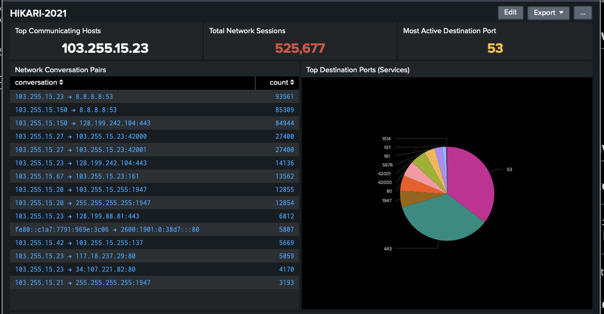

# HIKARI-2021 Botnet Investigation

## Overview

- Tool: Splunk SPL
- Data: HIKARI-2021 Dataset
- Tactic: Behavioral analysis over signature-based detection
- Focus: Network flow anomalies and host communication patterns.



## Investigation Steps

### Step 1: Top Source Hosts by Connection Count
```sql
index=hikari_2021
| stats count as Connection_Count by originh
| sort - Connection_Count
| head 10
```
**Identify hosts generating the most network connections for further investigation.**

### Step 2: Top Destination Hosts by Connection Count
```sql
index=hikari_2021
| stats count as Connection_Count by responh
| sort - Connection_Count
| head 10
```
**Find the most frequently contacted destinations across the network**

### Step 3: Most Active Host-to-Host Pairs
```sql
index=hikari_2021
| stats count as Connection_Count by originh, responh
| sort - Connection_Count
| head 15
```
**Analyze communication relationships to identify potential C2 channels**

### Step 4: Find Potential C2 Servers
```sql
index=hikari_2021
| stats 
    dc(originh) as Unique_Source_Hosts,
    sum(flow_duration) as Total_Connection_Time
    by responh
| where Unique_Source_Hosts > 2
| sort - Unique_Source_Hosts
| head 10
```
**Detect destinations receiving connections from multiple sources could be potential command and control servers**

### Step 5: Analyze Port Usage Patterns
```sql
index=hikari_2021
| stats 
    count as Connection_Count,
    dc(originh) as Unique_Sources
    by responp
| sort - Connection_Count
| head 10
```
**Identify which services and ports are most actively used across the network**

### Step 6: Find High-Frequency Communication
```sql
index=hikari_2021
| stats 
    count as Total_Connections,
    avg(flow_duration) as Avg_Duration
    by originh, responh
| where Total_Connections > 1000
| sort - Total_Connections
| head 10
```
**Focus on persistent, high-volume communication pairs that may indicate C2 activity**

### Step 7: Identify Coordinated Activity
```sql
index=hikari_2021
| stats 
    count as Connection_Count
    by responh, originh
| eventstats sum(Connection_Count) as Total_To_Destination by responh
| where Total_To_Destination > 5000
| sort - Total_To_Destination
| head 10
```
**Detect destinations receiving coordinated traffic from multiple sources**

### Step 8: Source/Destination Load Analysis
```sql
index=hikari_2021
| stats 
    count as Connections_To_Destination
    by responh
| eventstats avg(Connections_To_Destination) as Avg_Per_Destination
| eval Concentration_Ratio = Connections_To_Destination / Avg_Per_Destination
| where Concentration_Ratio > 100
| sort - Concentration_Ratio
```
**Find destinations with traffic volumes significantly above network average**

### Step 9: Data Exfiltration Detection
```sql
index=hikari_2021
| stats 
    sum(fwd_bulk_bytes) as Total_Data_Sent,
    sum(bwd_bulk_bytes) as Total_Data_Received,
    avg(fwd_bulk_rate) as Avg_Exfiltration_Rate
    by originh
| where Total_Data_Sent > Total_Data_Received * 10
| sort - Total_Data_Sent
| head 10
```
**Identify hosts with significant asymmetric data flow indicating potential data exfiltration activity**

### Step 10: Botnet Pattern Confirmation
```sql
index=hikari_2021
| stats 
    dc(originh) as Bot_Count,
    sum(flow_duration) as Total_C2_Time,
    sum(fwd_pkts_tot) as Total_Outbound_Traffic_
    by responh
| where Bot_Count >= 2 AND Total_C2_Time > 10000
| sort - Bot_Count
```
**Final confirmation of botnet infrastructure by identifying C2 servers with multiple bots and sustained communication**
